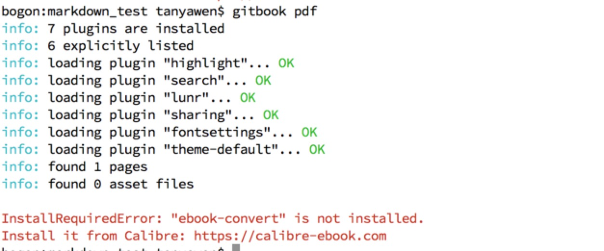

<center>应用案例及演示</center>
==
---

## Gitbook使用

#### 1、安装:node.js
略
####2、安装：gitbook-cli
```sh
sudo npm install -g gitbook-cli
```
常用命令:
```sh
gitbook help  
gitbook init  初始化
gitbook build 输出静态网站
gitbook serve 生成静态网页并运行服务器
gitbook pdf   导出pdf
```

#### 温馨提示:生成pdf报错如下

#### 解决方案
```sh
安装: ebook-convert  https://calibre-ebook.com/download
sudo ln -s /Applications/calibre.app/Contents/MacOS/ebook-convert /usr/local/bin
```

## 案例
1. [wokerman](http://doc.workerman.net)
2. [openresty最佳实践](https://moonbingbing.gitbooks.io/openresty-best-practices/content/index.html)

## gitbook项目基本目录结构
```sh
├── book.json
├── README.md
├── SUMMARY.md
├── chapter-1/
|   ├── README.md
|   └── something.md
└── chapter-2/
    ├── README.md
    └── something.md
```
## 配置
#### title
设置书本的标题
```json
"title":"2018.07.13周会分享"
```
#### author
作者相关信息
```json
"author":"yawen.tan"
```
#### description
本书的简单描述
```json
"description":"Markdown语法介绍及简单使用分享"
```
#### language
Gitbook使用的语言,可选的语言如下
```json
en, ar, bn, cs, de, en, es, fa, fi, fr, he, it, ja, ko, no, pl, pt, ro, ru, sv, uk, vi, zh-hans, zh-tw,zh
```
配置使用简体中文,zh
```json
"language" : "zh-hans",
```
#### gitbook
指定使用的gitbook版本
```json
"gitbook" : "3.2.2",
"gitbook" : ">=3.0.0"
```
#### root
指定存放 GitBook 文件（除了 book.json）的根目录
```json
"root": "."
```
#### links
在左侧导航栏添加链接信息
```json
"links" : {
    "sidebar" : {
        "首页" : "http://www.httpds.com"
    }
}
```
#### styles
自定义页面样式， 默认情况下各generator对应的css文件
```json
"styles": {
    "website": "styles/website.css",
    "ebook": "styles/ebook.css",
    "pdf": "styles/pdf.css",
    "mobi": "styles/mobi.css",
    "epub": "styles/epub.css"
}
```
例如使<h1> <h2>标签有下边框， 可以在website.css中设置
```css
h1 , h2{
    border-bottom: 1px solid #EFEAEA;
}
```

#### plugins
配置使用的插件
```json
"plugins": [
    "github"
],
"pluginsConfig": {
    "github": {
      "url": "https://github.com/iyw/markdown.git"
    }
 }
```
添加新插件之后需要运行gitbook install来安装新的插件

#### pluginsConfig
配置插件的属性
```json
"pluginsConfig": {
    "fontsettings": {
        "theme": "sepia",
        "family": "serif",
        "size":  1
    }
}
```
#### structure
指定 Readme、Summary、Glossary 和 Languages 对应的文件名，下面是这几个文件对应变量以及默认值：

|变量				|含义和默认值                               |
|:-----------------:|:---------------------------------------:|
|structure.readme	|Readme file name (defaults to README.md)|
|structure.summary	|Summary file name (defaults to SUMMARY.md)|
|structure.glossary	|Glossary file name (defaults to GLOSSARY.md)|
|structure.languages |Languages file name (defaults to LANGS.md)|

